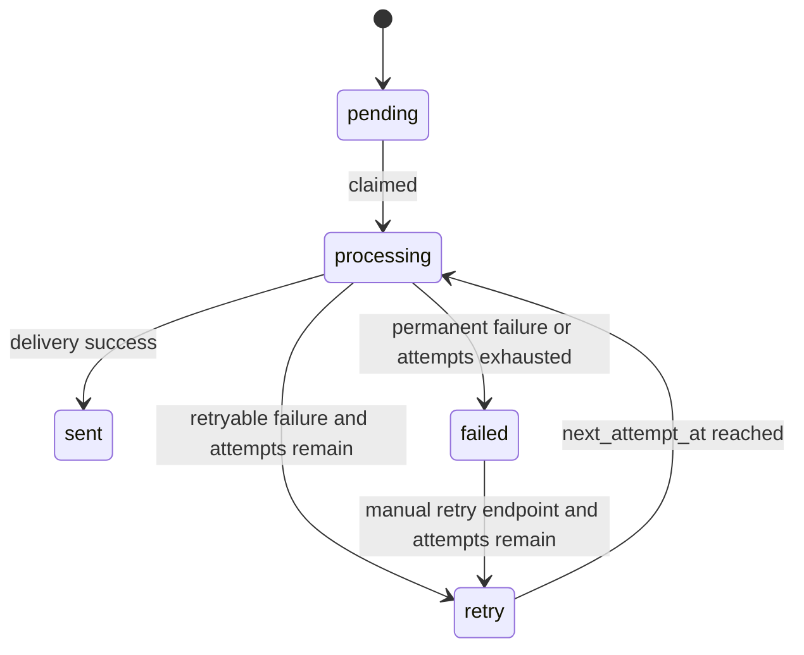
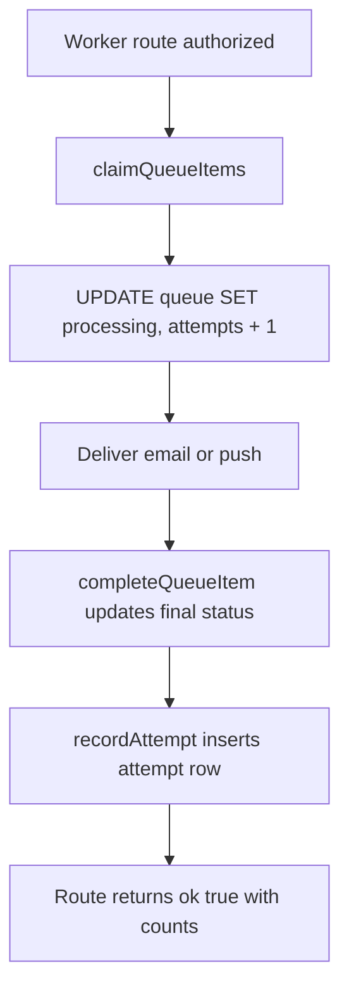

# Async Worker Integrity Audit

Status: audit and reproduction only. No e-mail, push, provider, live service or credential calls were made.

## Worker Surfaces

| Surface | File | Notes |
| --- | --- | --- |
| Notification worker route | `artifacts/api-server/src/routes/notification-worker.ts` | Admin-secret protected route returns worker result JSON. |
| Notification worker library | `artifacts/api-server/src/lib/notification-worker.ts` | Claims queue rows with `FOR UPDATE SKIP LOCKED`, processes e-mail and push. |
| Payment reminders route | `artifacts/api-server/src/routes/payment-reminders.ts` | Admin-secret protected, sends invoice reminder e-mail directly. |
| Queue schema | `lib/db/src/schema/notifications.ts` | Durable queue, attempts and idempotency key columns. |
| Queue migration | `lib/db/migrations/042_notification_worker_queue.sql` | Retry statuses, attempts table and unique idempotency index. |

## Queue Lifecycle

## Claim and Completion Boundary

The claim step is atomic. Completion and attempt logging are separate operations. If attempt logging fails, the worker logs the error but keeps the queue completion.

## Findings

| ID | Scenario | Evidence | Classification |
| --- | --- | --- | --- |
| ASYNC-001 | Suspended tenant queued delivery | `claimQueueItems` filters by channel/status/attempts, not tenant lifecycle. | Reproduced source evidence; needs real tenant status DB proof. |
| ASYNC-002 | Module disabled after queue creation | Notification worker does not call module guard. Payment reminders call `requireJobTenantModule(..., "finance")`. | Reproduced partial gap. |
| ASYNC-003 | Payment reminder suspended tenant | Payment reminder job checks finance module but not tenant runtime status. | Reproduced source evidence; needs DB lifecycle fixtures. |
| ASYNC-004 | Endpoint succeeds once then worker retries | Worker returns `ok: true` with `retried` counts for retryable delivery failures. | Reproduced source evidence. |
| ASYNC-005 | Retryable delivery failure | `failureOutcome` returns `retry` when attempts remain. | Reproduced source evidence. |
| ASYNC-006 | DLQ/final failure | Final failure is `status = failed`, not a separate DLQ. | Reproduced source evidence. |
| ASYNC-007 | Provider idempotency | Queue has producer-side unique `idempotency_key`; outbound email call does not pass an idempotency key. | Reproduced source evidence. |
| ASYNC-008 | Partial push success | Push delivery returns `sent` if at least one subscription/token succeeds, with failures in error text. | Reproduced source evidence. |
| ASYNC-009 | Audit attempt durability | Queue completion and attempt insert are not one DB transaction. | Reproduced source evidence; needs DB failure injection. |

## Denial and Audit Behavior

- Admin routes deny missing or invalid admin secret.
- Payment reminders skip tenants where the finance module guard fails.
- Notification worker has retry/failure attempt rows, but no tenant/module denial rows.
- Notification worker does not emit audit-log rows; it records delivery attempts.

## Recommendations for Later Remediation

Not implemented in this PR:

- Re-check tenant lifecycle and module enablement after claiming and before delivery.
- Add a `skipped_denied` terminal status or denial attempt reason.
- Make queue completion and attempt recording atomic.
- Pass provider-level idempotency keys for outbound providers that support them.
- Add a true DLQ table or explicit final-failure review workflow.
- Add real DB tests for suspended tenant, disabled module, stale lock recovery and attempt-log failure.
