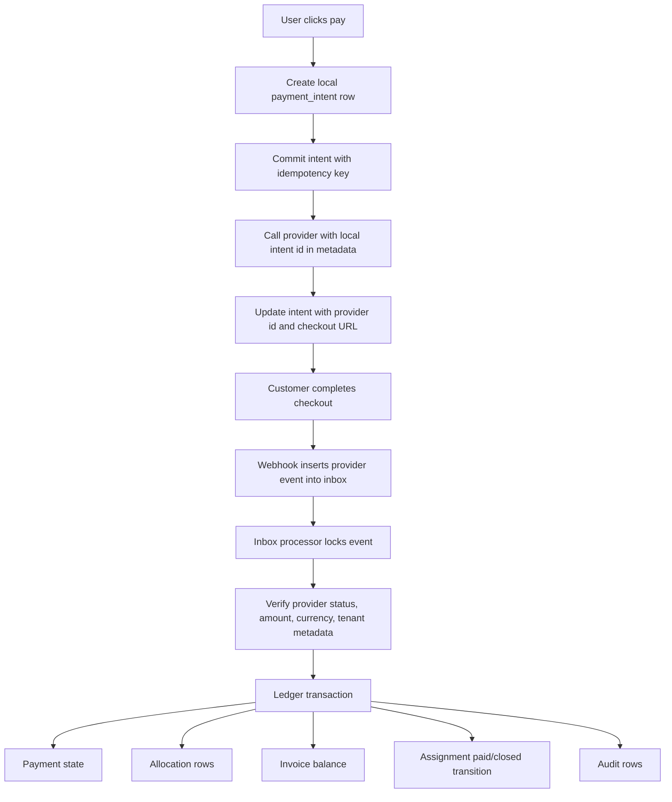
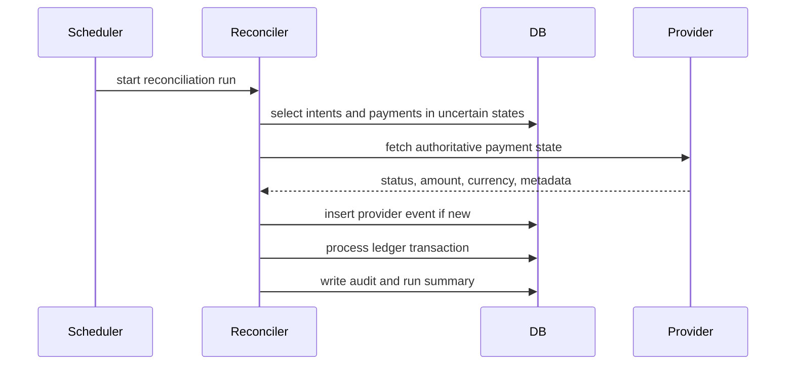

# Payment Inbox and Ledger Design Notes

Status: design target only. This task intentionally does not implement the full ledger.

## Current Shape

The current implementation has:

- `payments` with provider id, amount, currency, status, source type and optional invoice/source links.
- `payment_allocations` linking payments to invoices.
- `customer_payment_batches` and `customer_payment_batch_items` for collection payments.
- Credit-note draft canon with original invoice references.
- Webhook side effects that update payment, batch, invoice, allocation and assignment rows.

The current implementation does not have:

- A durable provider event inbox.
- A local payment intent created before the provider call.
- A monotonic payment status transition table.
- A reconciliation worker that compares local state to provider state.
- A complete refund/credit-note allocation ledger.
- A unique allocation guard for `(tenant_id, payment_id, invoice_id)` or an equivalent idempotency key.

## Proposed Boundary

## Required Future Tables

Suggested future tables, not created in this PR:

| Table | Purpose | Key constraints |
| --- | --- | --- |
| `payment_intents` | Durable local intent before provider call. | Unique `(tenant_id, invoice_id, status)` for active single-invoice intents, provider id nullable unique. |
| `payment_provider_events` | Inbox for raw webhook events. | Unique `(provider, provider_event_id)` or another provider-stable event key. |
| `payment_ledger_entries` | Immutable debit/credit ledger. | Append-only, tenant-scoped, references payment intent/payment/invoice. |
| `payment_reconciliation_runs` | Replay and repair evidence. | Run id, started/finished, provider cursor, counts. |

## Processing Rules

1. Payment initiation writes a local intent first and commits before the provider request.
2. Provider call uses a deterministic idempotency key where the provider supports it.
3. If provider succeeds but local update fails, reconciliation finds the intent by provider metadata.
4. If provider times out, the intent remains `provider_unknown` until reconciliation confirms created or absent.
5. Webhook route authenticates, stores the raw event and returns based on durable inbox write success.
6. Inbox worker handles business side effects in one transaction.
7. Status transitions are monotonic: `paid` must not regress to `open`, `failed`, `expired` or `canceled` without an explicit reversal.
8. Amount, currency, tenant id, customer id, invoice ids and provider metadata are verified before allocation.
9. Allocation uniqueness prevents duplicate payment-to-invoice allocation rows.
10. Refunds and credit notes create ledger entries rather than editing historical payment entries.

## Reconciliation Model

## Rollback Model

Rollback should be compensating, not destructive:

- Keep provider inbox events.
- Mark a ledger entry reversed with a linked reversal entry.
- Re-open invoice balance through a new entry.
- Emit audit rows for every compensation.
- Do not delete provider payment records or allocation history.

## Open Questions

- Whether the provider can supply a stable event id for all webhook deliveries.
- Whether active payment uniqueness should be per invoice, per customer batch, or per `(source_type, source_id)`.
- Whether assignment `paid` and `closed` should be separate transitions or whether finance should only mark paid.
- Whether manual overpayment is allowed as customer credit or must be rejected before insert.
