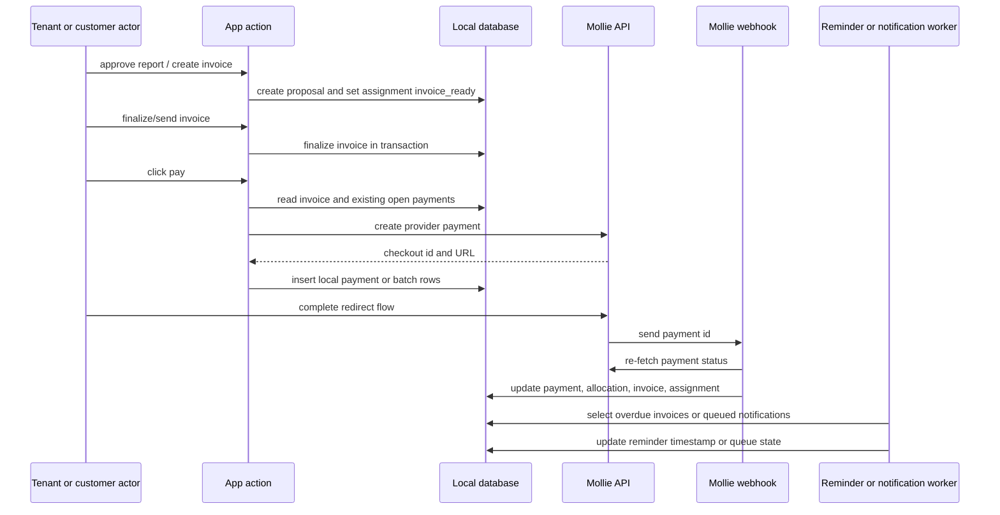
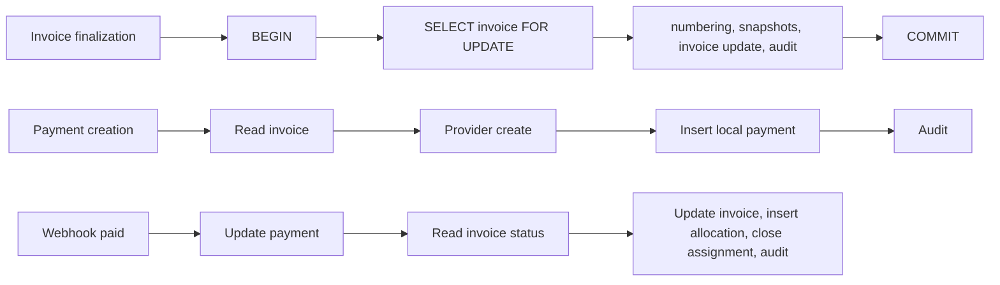

# Payment Integrity Threat Model

Status: audit and reproduction only. This pack does not call providers, use live credentials, create migrations, repair production behavior, or implement the full ledger.

## Scope

Traced flow:

1. Invoice proposal
2. Report approval
3. Invoice finalization
4. Payment intent
5. Provider request
6. Local payment record
7. Redirect/result
8. Webhook
9. Allocations
10. Invoice paid state
11. Assignment paid/closed state
12. Reminder/collection
13. Refund/credit note
14. Replay and reconciliation

Primary code evidence:

- Report approval creates invoice proposals through `artifacts/backoffice/src/app/actions/reports.ts` and `artifacts/backoffice/src/lib/invoice-proposals.ts`.
- Invoice finalization uses an explicit DB transaction with row lock in `lib/db/src/invoice-finalization.ts`.
- Backoffice and customer payment creation call Mollie before inserting local payment rows.
- Mollie webhook processing updates payments, batches, invoices, allocations and assignments in `artifacts/api-server/src/routes/webhooks.ts`.
- Payment, allocation and batch schema live in `lib/db/src/schema/payments.ts` and `lib/db/src/schema/customer-payment-batches.ts`.

## Flow

## Transaction Boundaries

Invoice finalization is transactional. Report approval, proposal creation, send/paid/cancel actions, payment creation and webhook side effects are multi-step flows without a single explicit transaction in the inspected source.

## Threats and Evidence

| ID | Scenario | Evidence | Current classification |
| --- | --- | --- | --- |
| FIN-001 | Provider success followed by local DB failure | Provider request happens before `db.insert(paymentsTable)` in backoffice and customer flows. | Reproduced by source-level executable test; needs real DB/provider-mock integration for runtime proof. |
| FIN-002 | Two concurrent payment clicks | Existing open payment is a preflight read before provider call; no transaction or invoice/status unique open-payment guard is present. | Reproduced as race evidence; needs real DB concurrency test. |
| FIN-003 | Local intent followed by provider timeout | Provider timeout returns failure before local intent exists. | Modeled negative design finding; no durable inbox/outbox row exists to reconcile timeout. |
| FIN-004 | Duplicate webhook | `mollie_payment_id` is unique, but paid webhook processing can re-enter allocation side effects when concurrent readers observe `sent`. | Reproduced by source-level test; needs DB race proof. |
| FIN-005 | Out-of-order webhook | Webhook maps provider status directly to local status before paid side effects and has no monotonic transition guard. | Reproduced by source-level test. |
| FIN-006 | Wrong amount/currency/metadata | Webhook response type only reads `id`, `status`, `paidAt`; no amount, currency or metadata comparison. | Reproduced by source-level test. |
| FIN-007 | Missing webhook secret | Missing `MOLLIE_WEBHOOK_SECRET` logs a warning and accepts the webhook. | Reproduced by source-level test. |
| FIN-008 | Retryable internal error returning 200 | Missing API key, failed provider re-fetch and catch-all errors return `200 ok`. | Reproduced by source-level test. |
| FIN-009 | Partial payment | Manual payments can set `partially_paid`; customer Mollie flow still charges `totalAmount`, not `outstandingAmount`. | Reproduced by source-level test. |
| FIN-010 | Overpayment | Manual payment clamps invoice paid total but records payment/allocation amount as requested. | Reproduced by source-level test. |
| FIN-011 | Duplicate allocation | No unique allocation key on `(payment_id, invoice_id)` and webhook inserts allocation after invoice-status read. | Reproduced by source-level test; needs concurrent DB proof. |
| FIN-012 | Collection payment trigger drift | Batch payment inserts `payments.invoice_id = null`, while an older tenant trigger still requires `NEW.invoice_id`. | Reproduced by source-level test; needs real DB migration-state proof. |
| FIN-013 | Mark paid bypasses ledger | `markInvoicePaid` sets invoice/assignment paid and closed without payment/allocation/paymentStatus state. | Reproduced by source-level test. |
| FIN-014 | Refund/credit note | Credit-note draft canon exists, but no standalone refund action/table or full reversal ledger was found. | Modeled only; no complete ledger implemented. |

## Audit and Denial Behavior

- Successful payment creation writes audit rows.
- Webhook status transitions write audit rows, but several webhook audit inserts omit explicit `tenantId` and rely on database trigger inference.
- Denial behavior exists for missing invoice, inactive Mollie settings, unauthenticated customer, invalid webhook signatures when a secret is configured, and admin-secret failures.
- Missing webhook secret is not a denial.
- Retryable webhook failures are not denied to Mollie; they are acknowledged with `200`, suppressing provider retry.

## Reproduction Artifacts

- `tests/security/payment-integrity-reproduction.test.mjs`
- `docs/finance/payment-runtime-test-matrix.md`
- `docs/finance/payment-inbox-ledger-design.md`
