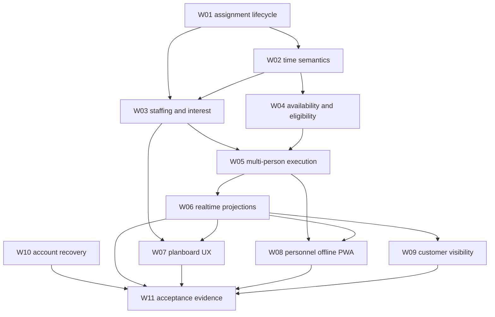

# Phase 2 Dependency Graph

The source of truth is `docs/phase-2/workstreams.json`; this diagram is descriptive. The validation test asserts that all dependencies refer to known workstream ids and that the graph is acyclic.
