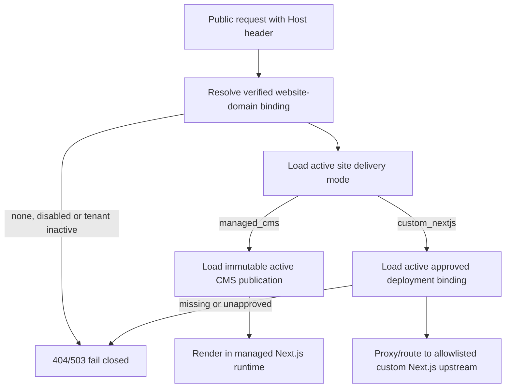

# Fieldgrid website module — repository analysis and architecture recommendation

Date: 21 July 2026
Status: Phase 0 discovery and architecture
Scope: analysis and planning only; no database, routing, deployment or product implementation

## Executive summary

Fieldgrid is a pnpm monorepo with three authenticated Next.js surfaces, an Express API, a shared Drizzle/PostgreSQL data layer, Supabase authentication, tenant-scoped RBAC, module entitlements and an existing VPS/Caddy deployment. The existing `artifacts/marketing-website` is a polished but tenant-specific, content-file-driven Next.js marketing site for Veele Services. It is useful as the first example of a custom enterprise website, but it is not a generic CMS and must not be converted into the shared website engine.

The recommended integration is:

1. add `website` as a Fieldgrid tenant module;
2. keep authoring in the existing backoffice;
3. put schemas, template presets and renderer contracts in a small shared website-core package;
4. run public managed websites in a separate Next.js App Router runtime;
5. resolve public domains server-side and fail closed for unknown, inactive or mismatched tenants;
6. make website delivery mode an explicit site property:
   - `managed_cms` for the standard Fieldgrid section engine;
   - `custom_nextjs` for an approved, separately deployed enterprise Next.js website;
7. route custom websites through an allowlisted deployment binding. A custom deployment origin is platform-managed and is never arbitrary tenant-supplied input.

`custom_nextjs` is not a template variant. Templates belong to the managed CMS engine; custom Next.js sites have their own code and deployment lifecycle. Switching modes preserves the inactive CMS publication and custom deployment so that an operator can perform an explicit, audited rollback without deleting content.

## Repository snapshot

The analysis was performed on local branch `marketing/website` at `37bbe5d6999b0d11505454d1ab3759e8caa6b6e3`.

- The branch contains five local marketing-site commits on top of `87337a6b5a407d8fc5aa6a2a8f8fa30e21c33299`.
- At analysis time `origin/main` was `99308f6344c85d5a562242295248b78b263b582d`.
- The branch was five commits ahead and seventeen commits behind `origin/main`.
- The missing main commits are primarily later Phase 2 fixes, deployment hardening and dynamic quality checklists. They do not invalidate the architectural findings, but the branch must be reconciled with exact current main before Phase 1 implementation.
- The only untracked root entry was `.worktrees/`; existing worktrees and their branches were left untouched.

## 1. Current stack

| Concern           | Current implementation                                                                               | Website-module consequence                                                                                                                            |
| ----------------- | ---------------------------------------------------------------------------------------------------- | ----------------------------------------------------------------------------------------------------------------------------------------------------- |
| Monorepo          | pnpm workspace, Node 24, pnpm 11.5.2                                                                 | Add packages through the workspace; do not introduce a second package manager.                                                                        |
| Framework         | Next.js 15 App Router for backoffice, customer PWA, personnel PWA and the custom marketing site      | Use App Router and server rendering for the managed public runtime.                                                                                   |
| API               | Express 5 in `artifacts/api-server`                                                                  | Suitable for shared public submission endpoints or privileged routing control, after adding explicit public security boundaries.                      |
| TypeScript        | Strict shared `tsconfig.base.json`, project references for libraries                                 | Put shared website contracts in a referenced workspace package and keep public/admin types aligned.                                                   |
| Styling           | Tailwind CSS 4, CSS variables, shared UI and shadcn-compatible Radix primitives                      | Reuse backoffice UI primitives for CMS screens; give the public engine its own lightweight section styling layer.                                     |
| UI                | `@workspace/shared-ui`, Radix primitives, Lucide, Sonner, React Hook Form                            | No new form or component framework is needed for the MVP.                                                                                             |
| Database          | PostgreSQL through Drizzle ORM and hand-written SQL migrations                                       | Add tenant-scoped Drizzle schemas plus timestamped SQL migrations with RLS, ACL and runtime tests.                                                    |
| Authentication    | Supabase Auth through `@supabase/ssr`; middleware refreshes sessions                                 | CMS routes stay inside authenticated backoffice. Public rendering must not depend on a user session.                                                  |
| Authorization     | Tenant roles and permissions, server-side `requirePermission`, module entitlement enforcement        | Add website resources to the existing RBAC and module maps; do not add another role system.                                                           |
| Tenant resolution | Verified `tenant_domains`, active tenant status and host-based resolution                            | Reuse ownership and verification, but add an explicit website-domain binding so operational tenant hosts and public website hosts cannot be confused. |
| Validation        | Zod/Zod v4, drizzle-zod and React Hook Form                                                          | Define one schema per section and validate at every write, publication and render boundary.                                                           |
| Rich text         | TipTap 3 is already in backoffice                                                                    | Reuse TipTap for editing, but persist JSON as canonical public content and render through an allowlist.                                               |
| Email             | Platform and tenant email providers through `lib/db/src/email-service.ts`, including Resend and SMTP | Form notifications can reuse the email service after submissions are durably stored.                                                                  |
| Storage           | Supabase Storage patterns, tenant-prefixed paths, document and knowledgebase media metadata          | Add dedicated website-media metadata and private tenant-prefixed source assets; do not put website media in generic documents.                        |
| Tests             | Node test runner, domain/security suites, PostgreSQL 17 runtime harness and Playwright               | Add source, migration, RLS, API and browser tests to the existing exact-head lanes.                                                                   |
| Deployment        | GitHub Actions, self-hosted runner, release directories, systemd, Caddy, staging health gate         | A managed website runtime and any routing gateway need explicit services, ports, health checks and rollback coverage before activation.               |

### Dependency inventory

Already available:

- Next.js, React and TypeScript;
- Tailwind CSS and shadcn-compatible UI primitives;
- Zod and drizzle-zod;
- React Hook Form;
- TipTap;
- Framer Motion, though it should remain optional for public sections;
- PostgreSQL/Drizzle;
- Supabase Auth and Storage;
- Playwright and axe;
- tenant-aware email delivery.

Not directly available or not yet approved for the website module:

- a drag-and-drop library;
- a public rich-text sanitizer contract;
- a distributed rate limiter such as Redis/Upstash;
- a generic reverse-proxy library or website-routing service;
- a dedicated image-transformation pipeline.

Recommendation: add no new runtime dependency in Phase 1. Start section ordering with accessible move-up/move-down controls. Render TipTap JSON through known nodes rather than adding HTML sanitization as a shortcut. Decide the delivery router after a focused routing spike.

## 2. Current domain model

### Users and tenants

- Supabase `auth.users` is the identity source.
- `tenants` contains the organization lifecycle and `starter`, `professional` or `enterprise` plan key.
- `tenant_users` links users to active tenants.
- `tenant_roles`, `tenant_user_roles`, `permissions` and `tenant_role_permissions` implement tenant-scoped RBAC.
- Server-side permission helpers resolve the current authenticated user and tenant and fail closed when either is missing.

### Tenant domains

`tenant_domains` already stores:

- tenant ownership;
- normalized unique domain;
- Fieldgrid subdomain/custom/platform-reserved type;
- primary marker;
- DNS and TLS verification state;
- activation/disable state and audit actors.

It currently drives tenant host resolution and Caddy on-demand TLS approval. It does not express which application surface owns the host. Public website routing therefore needs a separate binding, proposed as `website_domains`, referencing a verified `tenant_domains` row and exactly one website site. This avoids treating the operational `{tenant}.fieldgrid.nl` host as a public marketing website by accident.

### Organizations, branding and settings

- `organization_settings` stores legal/contact, planning and tenant email settings.
- `tenant_theme_settings` stores controlled white-label tokens and assets.
- `getTenantBranding()` already merges platform, legacy and tenant theme values.

The website module should initialize from these values but store website-specific theme, SEO, contact and social settings on the site. Operational backoffice theming and public website theming have different release and accessibility requirements and should not be the same mutable record.

### Customers, leads and contacts

- `customers.status` already supports `lead` and `prospect`.
- `customer_contacts` stores named customer contacts.
- There is no standalone lead or website form-submission model.

Website submissions should first be stored in a dedicated immutable `website_form_submissions` table. Converting a submission into a Fieldgrid customer with status `lead` must be an explicit tenant action, not a side effect of every public POST.

### Files and media

- `documents` is tenant-scoped operational document metadata.
- knowledgebase and release modules have specialized media tables and upload actions.
- tenant branding assets use tenant-prefixed storage paths.

Website media needs its own metadata because it requires alt text, focal/crop data, draft/public visibility, image dimensions and stable public delivery. Draft assets must not become public merely because they were uploaded.

### Existing content models

- News, knowledgebase and releases demonstrate draft/published/archived statuses, TipTap content, categories/targets, media and versioning.
- There are no Site, Page, PageSection, Navigation, Blog, Form, Submission, Redirect or WebsiteTemplate tables.

The knowledgebase renderer currently uses `dangerouslySetInnerHTML` with stored HTML and URL rewriting, without a separate public sanitization pass. It is acceptable only inside its existing trusted/authenticated assumptions and must not be copied into the public website runtime.

## 3. Current routing

### Backoffice

- Next.js App Router route groups separate authentication, tenant dashboard and platform-admin areas.
- Middleware performs session refresh and authentication only; authoritative RBAC lives in Server Components and Server Actions.
- Tenant selection uses verified host context, support context or an allowed tenant cookie.
- Dashboard routes are permission-gated and the sidebar hides unavailable modules.

Recommended admin routes follow the existing conventions:

- `/website`
- `/website/settings`
- `/website/pages`
- `/website/pages/[id]`
- `/website/navigation`
- `/website/blog`
- `/website/blog/[id]`
- `/website/forms`
- `/website/submissions`
- `/website/templates`

### Customer and personnel applications

- The customer PWA uses base path `/klant`.
- The personnel PWA uses base path `/personeel`.
- Both are authenticated application surfaces and are not suitable public website runtimes.

### Existing custom marketing website

`artifacts/marketing-website` is a standalone Next.js App Router app with:

- a catch-all route that statically generates 44 Veele routes from JSON;
- fixed TypeScript templates and section-like components;
- metadata, canonical URLs, sitemap, robots and JSON-LD;
- Zod-validated contact/quote forms;
- in-memory rate limiting;
- disabled/stub/webhook form delivery;
- no Fieldgrid tenant, CMS, database or durable lead integration;
- no service entry in the current four-service deployment health contract.

This app should be registered later as a `custom_nextjs` deployment for the Veele tenant. Its 44-route and claims-validation contracts remain intact.

### Public site domain namespace

The approved product contract intentionally keeps one public host per tenant. In
production, `{tenant}.fieldgrid.nl` serves the managed or approved custom
marketing website at `/`, while the authenticated applications remain under
the non-overlapping `/admin`, `/personeel` and `/klant` prefixes. Staging uses
the equivalent `{tenant}.staging.fieldgrid.nl` host. A verified custom domain
uses the same path contract.

This shared-host choice requires path isolation rather than a second website
subdomain. The personnel and customer applications already have real Next.js
base paths. The backoffice does not: it currently renders at `/`, and its auth
cookies are host-only but scoped to `path=/`. Before a public website runtime
can own `/`, the backoffice must move to a real `/admin` base path, including
assets, route handlers, redirects and Server Actions, and every backoffice-only
cookie must be restricted to `/admin`. The public runtime must not receive
application session cookies. The edge must route prefixed paths before the
website fallback and preserve each application's full base path.

Wildcard DNS for `*.staging.fieldgrid.nl` is operator-confirmed as provisioned.
Wildcard TLS coverage and exact host resolution still require runtime proof;
the existing `staging.fieldgrid.nl` certificate alone does not prove coverage
for tenant staging hosts. No production or staging host is activated by the
schema foundation or Phase 2A code.

## 4. Current admin UI conventions

- The dashboard shell uses `Sidebar`, `DashboardHeader`, permission providers and tenant branding variables.
- Pages are server components that load tenant data and permissions; mutations are server actions.
- Lists use tables/cards with explicit empty, loading and error states.
- Forms use React Hook Form, Zod, Radix/shadcn inputs and Sonner feedback.
- Settings use dedicated tabs/routes rather than one unbounded settings form.
- TipTap editors already exist for knowledgebase, news and releases.
- Dialog, drawer, sheet, switch, tabs, table, select, checkbox and accessible form primitives are available.

The CMS should match these patterns. Section reordering should begin with keyboard-accessible controls; visual drag-and-drop can be evaluated later without blocking the MVP.

## 5. Current constraints and compatibility risks

### Branch and integration state

The active branch is behind exact current main. No implementation PR should start until the custom marketing commits are rebased or otherwise reconciled through the approved PR process. Architecture documents can be reviewed independently.

### Domain ambiguity

`tenant_domains` proves tenant ownership but not the surface to which a domain routes. Reusing `is_primary` for website canonical URLs would conflict with the operational tenant primary domain. A website-domain binding with its own primary constraint is required.

### Public runtime is absent

The deployment restarts and health-checks backoffice, personnel, customer and API services only. A new website runtime or delivery router is an operational change and must be added with a staging-only health gate and rollback target before any domain is activated.

### Custom delivery switching

An arbitrary external URL stored by a tenant would create SSRF, open-proxy, cookie and content-integrity risks. Custom deployments must be created and activated by a platform operator, reference an allowlisted provider/routing key and pass host, TLS, health and ownership preflight.

### Rich text

Stored HTML cannot be trusted at the public boundary. Canonical TipTap JSON must be validated by node/mark allowlists. Unknown nodes are skipped or rendered as safe text in preview; publication fails for unsupported required content.

### Forms and spam protection

The custom marketing site's process-memory rate limit resets on restart and does not coordinate across instances. Production forms need durable rate limiting/deduplication, payload limits, origin/domain checks, a honeypot, audit-safe logging and optional stronger bot protection. Raw IP addresses should not be retained; use a rotating salted hash only when justified.

### Media

Generic operational documents and public marketing assets have different access contracts. Public media requires a dedicated route or publish pipeline, stable cache keys and explicit draft/published visibility.

### Analytics

Arbitrary script injection is prohibited. Initial analytics settings must be a provider enum plus validated public identifier, disabled until consent handling is implemented.

### Migrations

The repository has mixed historical migration names but now enforces timestamped migrations after numeric migration 101. New migrations must sort after the latest exact-main timestamp, be additive/backward compatible, update Drizzle schema exports and include migration-order, PostgreSQL 17, RLS and prior-release compatibility evidence.

## 6. Integration recommendation

### Module boundaries

Recommended conceptual layout, adapted to this monorepo:

```text
lib/website-core/
  section schemas and registry contracts
  template presets
  publication schema
  SEO and rich-text safe-render contracts

lib/db/src/schema/website-*.ts
lib/db/src/website-*.ts
  tenant-scoped persistence and resolvers

artifacts/backoffice/src/app/(dashboard)/website/
artifacts/backoffice/src/components/website/
  authenticated CMS

artifacts/website-runtime/
  public managed-CMS Next.js runtime

website delivery router/control plane
  host -> managed runtime or approved custom Next.js upstream
```

Do not merge the generic engine into `artifacts/marketing-website`. That app remains customer-specific code and can consume shared form/SEO contracts only where doing so does not weaken its independent release gates.

### Delivery-mode resolution



The delivery decision is server-side. It must never be selected from a request parameter, cookie or tenant-authenticated client setting.

### Switch contract

Before `managed_cms -> custom_nextjs`:

1. caller is an authorized platform operator;
2. tenant, site and domain are active and match;
3. enterprise/custom-site entitlement is active;
4. deployment binding is approved, immutable for the candidate release and healthy;
5. canonical host, TLS and expected release marker are verified;
6. public form integration and required secrets are preflighted;
7. current delivery revision is supplied for optimistic locking;
8. change is committed atomically and written to `audit_log`;
9. caches are invalidated by site delivery revision;
10. post-switch HTTP, SEO and form smokes pass.

The reverse switch follows the same contract and requires a ready managed publication. No automatic runtime fallback should silently serve a different site. On failure, the operator explicitly rolls back to the previously recorded delivery mode/revision.

### Rendering

- Public managed pages are server-rendered and cached by site publication ID.
- Authoring rows are never queried directly by an anonymous request.
- Publication produces an immutable validated snapshot; activation is atomic.
- Section renderers are registry-based and receive parsed data only.
- Unknown sections are skipped in public output and surfaced in admin diagnostics.
- Rich text uses a code-owned TipTap node/mark renderer; no arbitrary HTML, JavaScript or CSS classes.
- Draft preview uses a short-lived, signed, user-bound preview token and is `noindex`/`no-store`.

### Forms and lead flow

The minimal safe path is:

1. resolve site and form from the trusted host;
2. validate the configured schema and submitted payload;
3. apply durable throttling/deduplication and spam checks;
4. store a tenant-scoped submission;
5. enqueue/send a notification through the existing tenant email service;
6. let an authorized user explicitly convert the submission to a customer with status `lead`.

Custom Next.js sites call the same public submission API using their verified host and a form public ID. They receive no database or service-role credentials.

### Dependencies

For the first implementation phase:

- add no page-builder, drag-and-drop, analytics or animation dependency;
- reuse Zod, Drizzle, TipTap, React Hook Form and existing UI primitives;
- keep Framer Motion optional and out of the base public bundle;
- perform a short routing spike before choosing a proxy library or Caddy integration;
- evaluate image transformation only after media delivery requirements are proven.

## 7. Risks and resolved decisions

| Topic                       | Approved/default contract                                                   | Decision owner          |
| --------------------------- | --------------------------------------------------------------------------- | ----------------------- |
| Public tenant host          | Production `{tenant}.fieldgrid.nl`; staging `{tenant}.staging.fieldgrid.nl` | Product                 |
| Shared-host route ownership | Website `/`; apps `/admin`, `/personeel`, `/klant`                          | Product/architecture    |
| Backoffice isolation gate   | Real `/admin` base path and `/admin`-scoped cookies before public routing    | Architecture/security   |
| Staging wildcard DNS/TLS    | DNS provisioned; certificate and host resolution require staging proof      | Infrastructure          |
| Custom site hosting         | Dedicated approved deployment per customer, not arbitrary tenant URL        | Platform operations     |
| Delivery router             | Dedicated host router or atomic Caddy adapter; prove in staging spike       | Architecture/operations |
| Number of sites per tenant  | Schema supports multiple; MVP UI exposes one primary site                   | Product                 |
| Form-to-customer mapping    | Manual conversion after durable submission                                  | Product/privacy         |
| Public media                | Private source plus controlled public delivery/publication                  | Security/operations     |
| Analytics                   | Disabled until consent-aware provider contract exists                       | Privacy/product         |
| Custom-site tenant controls | Tenant can view status; platform operator controls deployment and switching | Product/security        |

## 8. Safest first implementation phase

Phase 1A and Phase 1B were merged in PR #353. The active safe increment is
Phase 2A shared-host application isolation:

- move the backoffice to the real `/admin` base path;
- path-scope application session and auxiliary cookies;
- prove deterministic shared-host route precedence and host classification;
- keep DNS, proxy, staging and production state unchanged.

This increment creates the application-isolation boundary required before the
managed or custom website runtime can own `/`, without changing live routing.

## 9. Validation commands for later phases

Use the exact scripts present in the repository and add focused website suites to the existing lanes:

```bash
pnpm fieldgrid:migration-order-check:check
pnpm fieldgrid:test:contract-static
pnpm fieldgrid:test:unit-domain
pnpm fieldgrid:test:security-source
pnpm run typecheck
pnpm build
```

Database phases additionally require the existing PostgreSQL 17, tenant A/B, RLS, API-runtime and prior-release compatibility lanes. Public/admin UI phases additionally require Playwright, axe, keyboard, mobile, metadata, sitemap, robots, wrong-host, draft-leak and cross-tenant tests.
